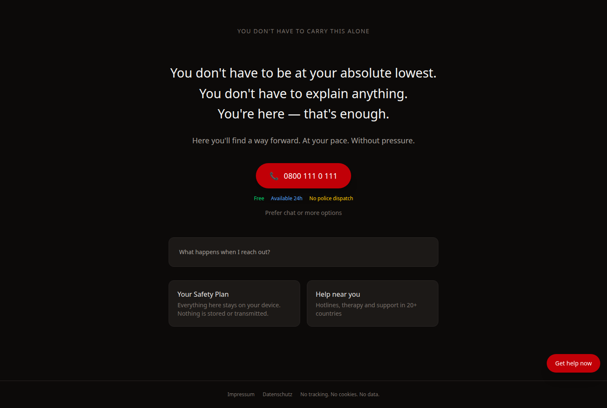
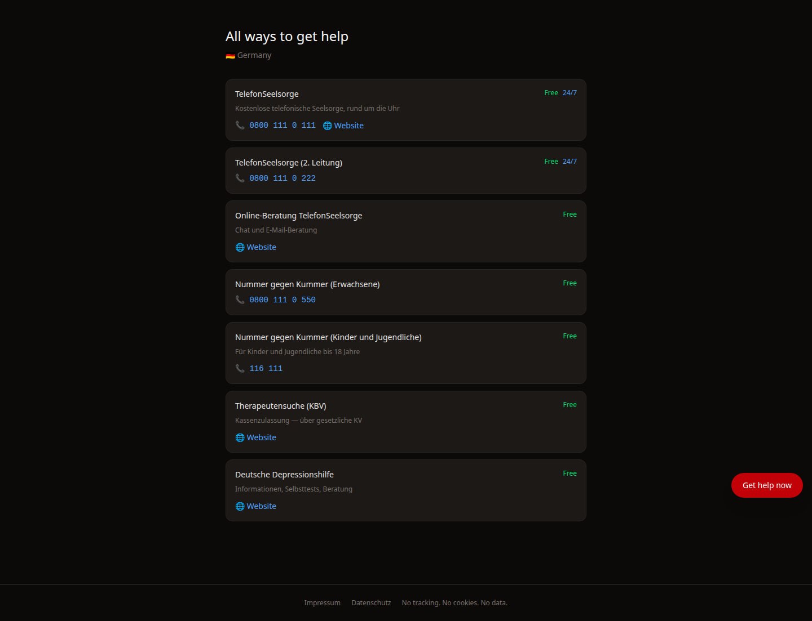
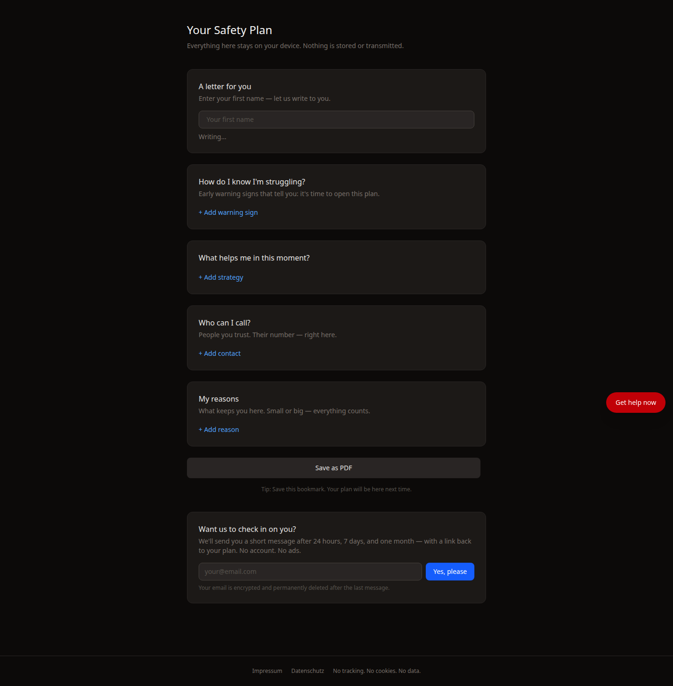
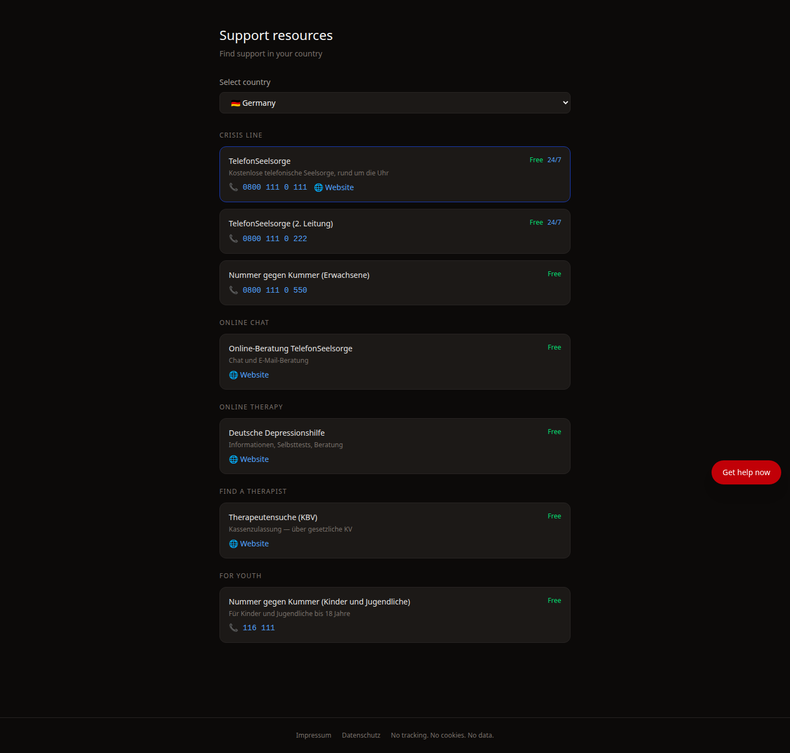

# Suicide Prevention Platform

An international, multilingual suicide prevention web app. Accessible, private-by-design, and operated as a German e.V. nonprofit.

**Zero user data stored.** Safety plans live in the browser only. All AI calls are stateless.

---

> **Work in progress — vibe coded with [Claude Code](https://claude.ai/code)**
>
> This codebase was rapidly prototyped with AI assistance and has not yet undergone a professional security audit, accessibility audit, or clinical review. It is not production-ready. Do not deploy it as a live crisis service without a thorough review by qualified engineers, mental health professionals, and a lawyer familiar with German law (DSGVO).
>
> Contributions, audits, and critical feedback are very welcome.

---

## Screenshots

| Home | Talk / AI letter |
|---|---|
|  |  |

| Safety Plan builder | Crisis resources |
|---|---|
|  |  |

---

## Features

- **Multilingual** — 8 languages: German, English, Russian, Korean, Japanese, Lithuanian, Ukrainian, Spanish
- **Geolocation-aware crisis resources** — 20 countries, automatically detected via DB-IP Lite (CC BY 4.0)
- **AI "reasons to live" letter** — Claude (claude-sonnet) generates a personalised, safety-filtered letter
- **Safety plan builder** — stored in `localStorage` only, exportable as PDF
- **Follow-up check-ins** — opt-in email reminders at +24h / +7d / +30d; email is AES-256-CBC encrypted, wiped after send
- **DSGVO-compliant** — Impressum + Datenschutzerklärung on every page; no Google Analytics

---

## Stack

| Layer | Technology |
|---|---|
| Backend | Symfony 8 / PHP 8.4 |
| Frontend | HTMX 2 + Alpine.js + Tailwind 4 |
| Database | PostgreSQL 16 via Doctrine ORM |
| AI | Anthropic Claude API (stateless) |
| Geolocation | DB-IP Lite MMDB (CC BY 4.0) |
| Email | Symfony Mailer |
| Container | FrankenPHP |

---

## Quickstart

### Prerequisites

- Docker + Docker Compose
- GNU Make

### 1. Clone and configure

```bash
git clone https://github.com/YOUR_ORG/suicide-prevention-app.git
cd suicide-prevention-app
cp .env.example .env.local
# Edit .env.local — set APP_SECRET, DATABASE_URL, ANTHROPIC_API_KEY
```

### 2. Start the stack

```bash
make start     # build images + start containers (detached)
make geoip     # download DB-IP country lite MMDB (~7 MB)
```

### 3. Initialise the database

```bash
make sf-migrate              # run Doctrine migrations
make sf c="doctrine:fixtures:load --append"   # seed 20 countries + 32 crisis resources
```

### 4. Open the app

Visit [http://localhost](http://localhost). Default locale is German (`/de`).

---

## Make commands

| Command | Description |
|---|---|
| `make up` | Start containers (detached) |
| `make down` | Stop containers |
| `make build` | Rebuild Docker images |
| `make start` | Build + start |
| `make logs` | Follow container logs |
| `make sh` | Shell into the PHP container |
| `make test` | Run PHPUnit test suite |
| `make test c="tests/path/FooTest.php"` | Run a single test file |
| `make cc` | Clear Symfony cache |
| `make sf c="<command>"` | Run any `bin/console` command |
| `make sf-migrate` | Run Doctrine migrations |
| `make tw` | Compile Tailwind CSS (once) |
| `make tw-watch` | Watch + recompile Tailwind |
| `make geoip` | Download/refresh DB-IP MMDB |

---

## Environment variables

| Variable | Required | Description |
|---|---|---|
| `APP_ENV` | yes | `dev` / `prod` / `test` |
| `APP_SECRET` | yes | 32-char hex secret for Symfony |
| `DATABASE_URL` | yes | PostgreSQL DSN |
| `MAILER_DSN` | yes | SMTP or null transport |
| `ANTHROPIC_API_KEY` | yes | Anthropic Claude API key |
| `GEOIP_DB_PATH` | yes | Path to DB-IP MMDB inside container |
| `FOLLOWUP_FROM_EMAIL` | yes | Sender email for follow-up messages |
| `FOLLOWUP_FROM_NAME` | yes | Sender display name |
| `APP_URL` | yes | Public HTTPS URL (used in email links) |

See `.env.example` for full documentation.

---

## Running tests

```bash
make test
```

25 unit tests, 41 assertions. Covers `SafetyOutputFilter` (adversarial inputs) and `FollowupService` (AES-256-CBC round-trip).

---

## Contributing

See [CONTRIBUTING.md](CONTRIBUTING.md). The most impactful contributions are:

- **Crisis resource updates** — phone numbers change; use the [crisis resource update issue template](.github/ISSUE_TEMPLATE/crisis_resource_update.md)
- **New translations** — open a PR adding a `messages.{locale}.yaml` file
- **Bug reports** — use the [bug report template](.github/ISSUE_TEMPLATE/bug_report.md)

---

## Privacy & safety

This project follows [safe messaging guidelines](https://www.iasp.info/resources/Safe_Messaging_Guidelines/) throughout. All AI output passes through `SafetyOutputFilter` before rendering. If you discover a safety issue, please follow [SECURITY.md](SECURITY.md) — do **not** open a public issue.

---

## License

MIT — see [LICENSE](LICENSE).

DB-IP data is CC BY 4.0 — attribution in Datenschutzerklärung.
